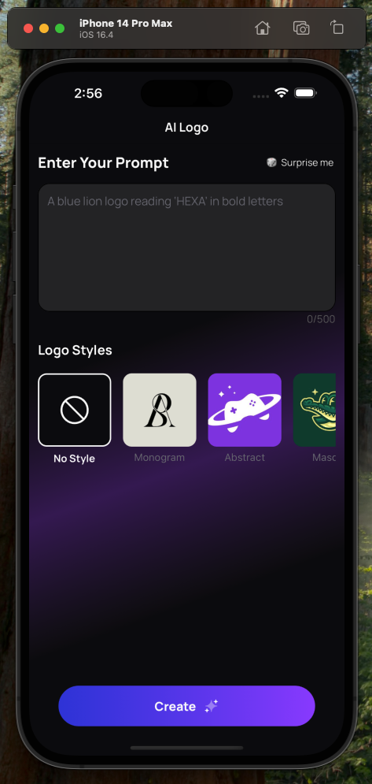
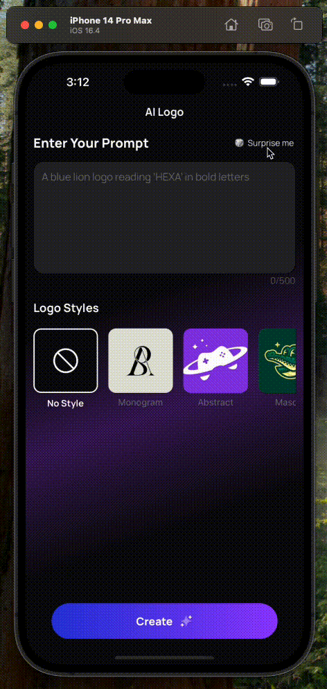

# Logo Generator App - Technical Assessment

[](assets/videos/demo.mp4)
*(Click the image above to view the app demo video)*
## Created By
Yavuz Selim Sahin

## Project Overview

This application was developed as part of a technical assessment for [Company Name]. It's a React Native logo generator app built with Expo that:

- Allows users to input design prompts
- Select from different logo styles
- Simulates AI-powered logo generation
- Stores requests in Firebase Firestore
- Provides real-time status updates

## Technical Stack

- **Framework**: Expo (React Native)
- **Navigation**: Expo Router (file-based routing)
- **Styling**: StyleSheet + LinearGradients
- **Backend**: Firebase Firestore (real-time database)

## Setup Instructions

### Prerequisites

1. Node.js (v18+ recommended)
2. Expo CLI (`npm install -g expo-cli`)
3. Firebase project with Firestore enabled
4. Android/iOS simulator or physical device

## Get started

1. Install dependencies

   ```bash
   npm install
   ```
2. Start the app

   ```bash
   npx expo start

3. Configure Firebase
credentials with your own project details to get started quickly:
   ```typescript
   const firebaseConfig = {
         apiKey: "YOUR_API_KEY",
         authDomain: "YOUR_PROJECT_ID.firebaseapp.com",
         projectId: "YOUR_PROJECT_ID",
         storageBucket: "YOUR_PROJECT_ID.appspot.com",
         messagingSenderId: "YOUR_SENDER_ID",
         appId: "YOUR_APP_ID"
         }

         export default firebaseConfig;
   ```
## Details

1. **Error Simulation**:
The error state is simulated in db/logoRequest.ts by default, the failure rate is set to 10% (1 in 10 attempts). You can adjust this ratio in the code to test different error scenarios. And in the below error chip shown


2. **Processing Time Optimization**:
While the assessment document specified 30-60 second wait times, i reduce this interval to 3-5 seconds (randomized) in the actual implementation for video recording purposes. The duration can be modified in the code for testing different intervals.


